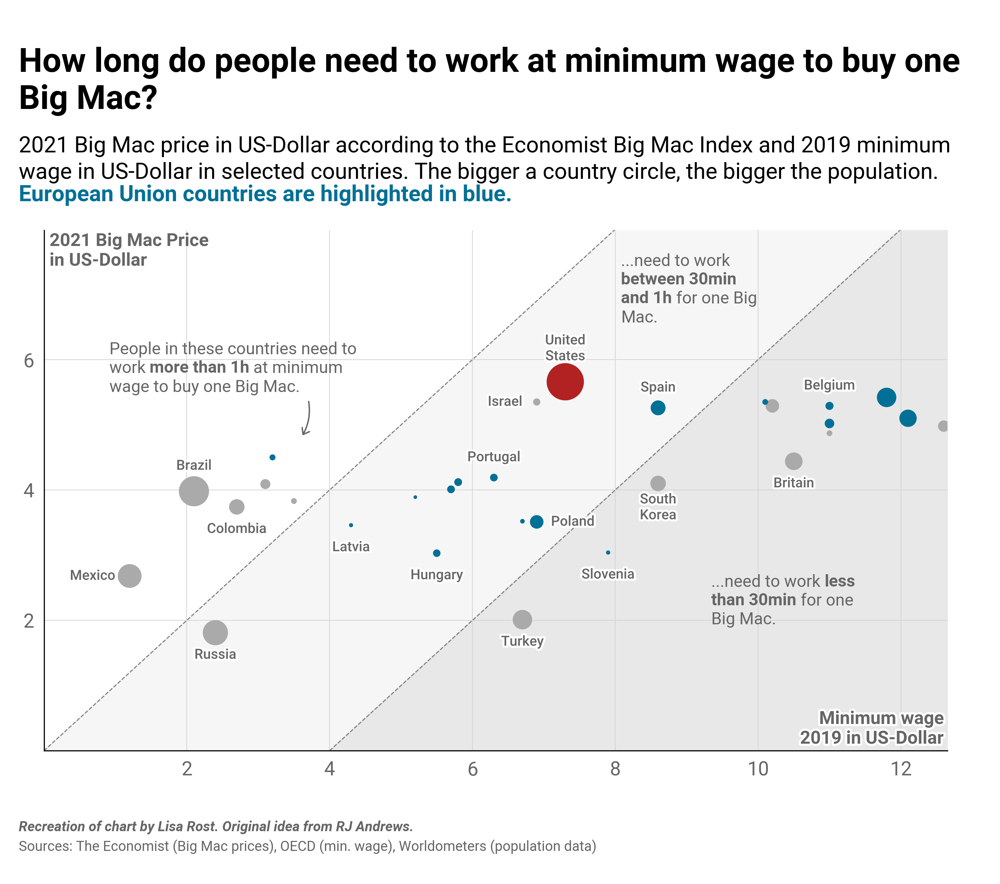

# Introduction

This notebook was put together to quickly attempt to recreate Lisa Rost's Big Mac chart (found in repo).

Code is nothing fancy and there's a lot of homework for people in the plotting code to make things more efficient around spacing at margins, labelling points etc...

The purpose was to see how it was fit together and to be used in an upcoming newsletter.

